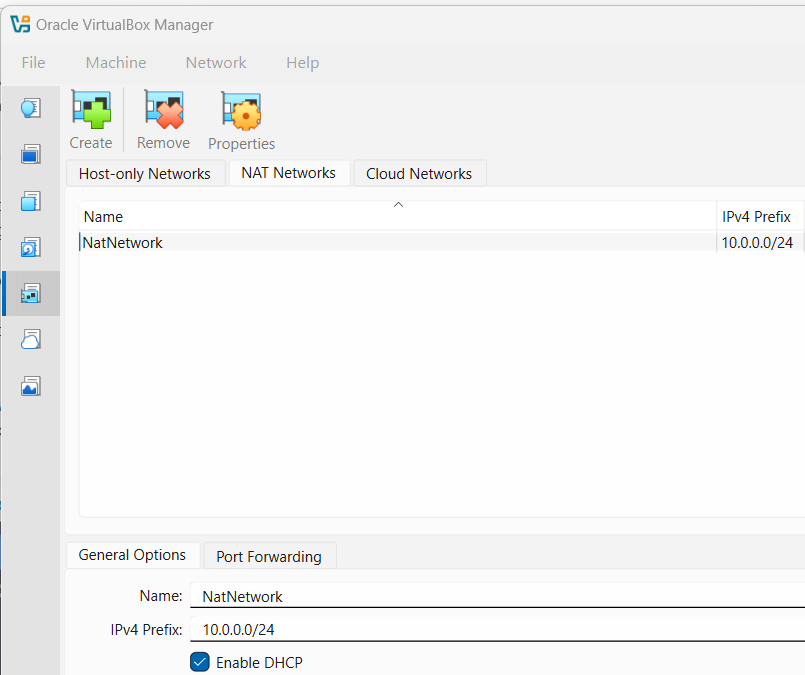
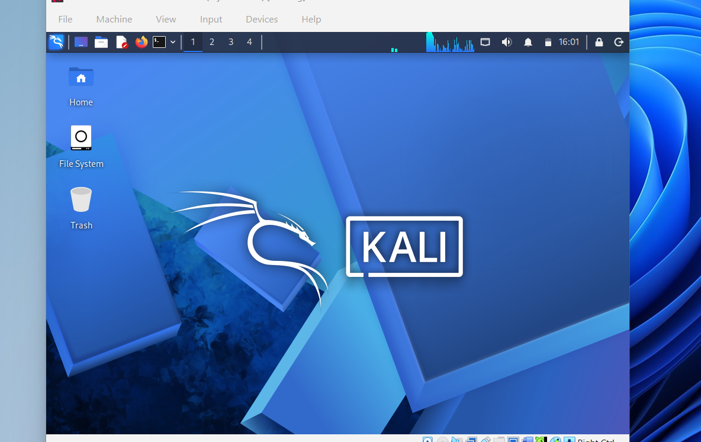
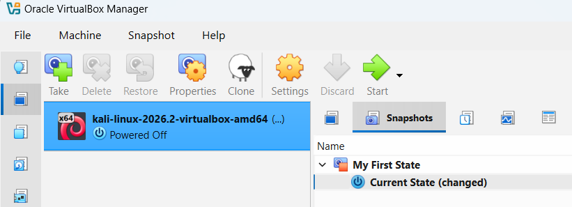

# networkwalks-B083C-week1-Cybersecurity-Lab-Setup
Cybersecurity lab setup
<div align="center">


**first steps of creating a virtual lab for pen testing and ethical hacking**

</div>

##  Project Overview

For Week 1 of the Cyber Securtiy Internship held by network walks I have setup a virtual lab on Kali Linux via Oracle Virtual Box.

The lab is a controlled environment to practice and develop ethical hacking and penetration testing, and other security skills.

it is configured on a private Nat network in order to accommodate more machines later on

---


## Objectives

- Install Oracle VirtualBox.
- Install Kali Linux.
- Import Kali linux on the virtual machine.
- Create a private **NAT Network** for the cybersecurity lab.
- Configure and verify network connectivity for Kali Linux.
- Create a snapshot for current clean setup/state on the VM.
- Create a configured and protected lab environment for practice. 

---

## Purpose of the Lab

A clean lab environment that's protected and configured for practical use.

It can be used for activities such as:

- Network reconnaissance
- Port scanning
- Vulnerability assessment
- Packet analysis
- Web security testing
- Exploitation practice
- Security-tool experimentation

⚠️ **Important:** This laboratory must only be used for systems that you own or have explicit permission to test. Do not use the lab or its tools to attack unauthorized systems.

---

## 🏗️ Lab Architecture


Additional target machines can be added to the same virtual network in future projects.

---

#  Lab Setup

## Step 1. Install 7-Zip

7-Zip was installed to extract the Kali Linux virtual-machine package, which may be distributed as a `.7z` archive.

**Tool:** 7-Zip

---

## Step 2. Install VirtualBox

VirtualBox was installed as the hypervisor.

---

## Step 3. Create the NAT Network

A dedicated NAT Network was created in VirtualBox.

Configuration:
Network Name: NatNetwork
IPv4 Prefix:  10.0.0.0/24
DHCP:         Enabled
IPv6:         Disabled



A **NAT Network** was used to create a controlled environment to keep viruses or any sort of harmful things contained


---

## Step 4. Import Kali Linux

The Kali Linux virtual machine was downloaded from the official Kali Linux website and imported into VirtualBox.

The VM network adapter was configured as follows:

```text
Adapter 1
Attached to: NAT Network
Network:     NatNetwork
Adapter Type: Intel PRO/1000 MT Desktop
```




---

## Step 5. Configure the Kali Linux Network

The Kali Linux network configuration was checked and configured with a consistent IPv4 address.

Example configuration:

```text
IP Address: 10.0.0.2
Subnet Mask: 255.255.255.0
Gateway: 10.0.0.1
DNS: 8.8.8.8
```

A consistent IP address makes it easier to document the lab and reference the Kali machine in future exercises.


---

## Step 6. Create a Clean VM Snapshot

After completing the initial configuration, a VirtualBox snapshot was created.

Example snapshot name:



The snapshot represents the clean baseline of the laboratory.

If a future exercise changes or damages the VM configuration, the machine can be restored to this baseline.


---

# 🔎 Lab Verification

| ✅ Test                        | 🧾 Command                      | 🎯 Expected Result              |
| ----------------------------- | ------------------------------- | ------------------------------- |
| 🌐 Check IP address           | `ip a`                          | Correct Kali IP displayed       |
| 📡 Test gateway               | `ping 10.0.0.1`                 | Successful replies              |
| 🌍 Test Internet connectivity | `ping 8.8.8.8`                  | Successful replies              |
| 🧰 Verify Nmap                | `nmap --version`                | Nmap version displayed          |
| 🔄 Verify snapshot            | Restore snapshot and run `ip a` | Baseline configuration restored |

### Example Results

```text
IP Address:
10.0.0.2/24

Gateway:
10.0.0.1

DNS:
8.8.8.8
```

---

# 🐞 Problems Encountered & Solutions


## Problem 1. Internet Connectivity

For versions of kali Linux after 2026.2 we use this commmand
One workaround used during this lab was:

```bash
sudo nmcli connection modify "Wired connection 1" ipv4.dad-timeout 0
```

The network connection was then restarted/rebooted and connectivity was tested again.

## Problem 2: Configure Network
After configuring the network instead of 10.0.0.2 it showed 10.0.0.3 so I restarted kali Linux which fixed this issue

----


#  Tools & Resources

- **7-Zip:** [https://7-zip.org/download.html](https://7-zip.org/download.html)
- **VirtualBox:** [https://virtualbox.org/wiki/Downloads](https://virtualbox.org/wiki/Downloads)
- **Kali Linux:** [https://kali.org/get-kali](https://kali.org/get-kali)

---

#  Author

**Halima**
Internee BatchB083C

LinkedIn: [https://www.linkedin.com/in/halima-j-78643a373/](https://www.linkedin.com/in/halima-j-78643a373/)
